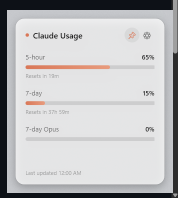

# Claude Usage Tracker (Windows)

[](https://github.com/Kylittleman/ClaudeUsageTracker/releases/latest/download/ClaudeUsageTracker.exe)
[](LICENSE)

*Single exe, no installer. See [Quick start](#quick-start) below.*



A Windows system-tray app that shows your live claude.ai usage - 5-hour and 7-day/weekly
limits, plus 7-day Opus usage - without opening the Settings > Usage page in a browser.

Inspired by two macOS menu-bar apps:
- [Usage4Claude](https://github.com/f-is-h/Usage4Claude)
- [Claude-Usage-Tracker](https://github.com/hamed-elfayome/Claude-Usage-Tracker)

Built with C# / .NET 8 (WPF), [H.NotifyIcon.Wpf](https://github.com/HavenDV/H.NotifyIcon) for
the tray icon, and [WebView2](https://developer.microsoft.com/microsoft-edge/webview2/) (a
real embedded Edge/Chromium engine, built into Windows 11) for talking to claude.ai.

The popup and settings windows use a frosted-glass (acrylic) design that auto-matches your
Windows light/dark theme, with animated progress bars and a Claude-branded accent color -
not the default flat WPF look.

## Quick start

1. **[Download ClaudeUsageTracker.exe](https://github.com/Kylittleman/ClaudeUsageTracker/releases/latest/download/ClaudeUsageTracker.exe)**
   and run it. See [About the Windows SmartScreen warning](#about-the-windows-smartscreen-warning)
   below - it's expected and safe to click through.
2. It opens Settings automatically on first run. Click **Log in with claude.ai** - a window
   opens, sign in to claude.ai like you normally would, and it closes itself once you're in.
3. Pick your organization (auto-loaded after login) and click **Save**.
4. It drops into your system tray showing your live 5-hour usage %. Click the icon any time
   for the full breakdown.

## About the Windows SmartScreen warning

When you run the downloaded exe, Windows will show **"Windows protected your PC"** with an
"Unknown publisher" warning. This is expected, and here's exactly why:

Windows SmartScreen doesn't scan for malicious *behavior* here - it just checks whether an exe
is signed with a paid code-signing certificate ($100s/year) and has enough download history to
have built up "reputation." A brand-new indie tool distributed for free on GitHub has neither,
regardless of what the code actually does. It's a trust-of-publisher signal, not a virus scan
result.

To proceed: click **More info**, then **Run anyway**.

If you'd rather not take that on faith, the source is entirely in this repo - every network
call it makes is in [`Services/ClaudeApiClient.cs`](Services/ClaudeApiClient.cs) (only talks to
`claude.ai`, nothing else), and you can [build it yourself](#building-from-source) from source
instead of using the prebuilt release, which sidesteps the warning entirely since Windows only
flags files downloaded from the internet, not ones you compiled locally.

## How it works

Neither this app nor the macOS originals read any local Claude Code files. They call
claude.ai's own web API directly:

- `GET https://claude.ai/api/organizations` - discovers your organization(s)
- `GET https://claude.ai/api/organizations/{org_id}/usage` - returns `five_hour`,
  `seven_day`, and `seven_day_opus` utilization percentages

**Why WebView2 instead of a plain HTTP client:** those endpoints sit behind Cloudflare bot
protection that blocks bare HTTP requests outright - even ones carrying a valid, correctly
copied session cookie - because it can't run the JS challenge a real browser solves
automatically. So this app logs in and fetches data through an actual embedded Edge engine
(WebView2) rather than raw HTTP calls, which is presumably what the macOS apps' "embedded
browser login" option does too. Your login session is stored in WebView2's own local browser
profile (`%LOCALAPPDATA%\ClaudeUsageTracker\WebView2`), the same way a real browser stores it
- not something this app manages or encrypts itself.

## Features

- Tray icon shows your current 5-hour usage % directly (green/amber/red).
- Click the tray icon for a popup with all three usage bars and reset countdowns.
- Click the pin icon (top-right of the popup) to keep it open on screen permanently, instead
  of it closing when you click away - it'll stay pinned across restarts too.
- Adaptive refresh: faster while you're actively checking, slower when idle.
- Optional Windows notification when usage crosses 80% / 95%.
- Optional auto-start at Windows login (adds a `HKCU...\Run` entry - no installer needed).

## Building from source

Requires the .NET 8 SDK. The WebView2 Runtime must be present on the machine (ships with
Windows 11 by default).

```
dotnet build
dotnet run
```

## Publishing a standalone exe

```
dotnet publish -c Release -r win-x64 --self-contained true -p:PublishSingleFile=true -p:IncludeNativeLibrariesForSelfExtract=true -o publish
```

Produces the same kind of single self-contained `ClaudeUsageTracker.exe` attached to
[Releases](https://github.com/Kylittleman/ClaudeUsageTracker/releases) - runs without the
.NET SDK/runtime installed. Not checked into this repo; build it yourself or grab the release.

## Troubleshooting

If the login window opens and then closes on its own without you finishing sign-in, or
Settings won't show you as logged in, check `%TEMP%\ClaudeUsageTrackerDebug.log` - it logs
each step of the login flow (cookie names only, never values) and will usually show exactly
where it stopped.

## Privacy

This app only talks to `claude.ai` (through the embedded browser component) and nowhere else.
Nothing is sent anywhere else; there is no telemetry.

## License

[MIT](LICENSE) - free to use, modify, and distribute.
